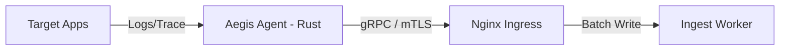

# 🦀 Aegis AI — Infrastructure Agent

**Project ID:** AEGIS-CORE-2026

> The **Aegis AI Agent** is the high-performance collection sensor deployed within target environments. Written in **Rust**, it captures real-time telemetry and securely streams it to the Aegis Ingest workers via **mTLS-encrypted gRPC** channels.

---

## 🏗️ Role in the Ecosystem

The Agent acts as the platform's "Eyes and Ears" on the ground. It is designed for minimal resource footprint and maximum reliability.

- **Real-time Telemetry**: Streams logs, metrics, and process events with microsecond latency.
- **Secure Tunneling**: Establishes a hardened outbound-only connection to the Aegis Core.
- **Auto-Discovery**: Identifies running containers and services within the local namespace.



---

## 🛠️ Tech Stack & Performance

| Component | Technology | Version |
|---|---|---|
| Language | **Rust** | 1.85+ |
| Async Runtime | **Tokio** | 1.x |
| Transport | **TLS-encrypted outbound streaming** | Implementation-defined |
| Performance | < 20MB RSS | — |

---

## 🔐 Security & DevSecOps

- **Mutual TLS**: The Agent **requires** a valid client certificate to speak to the Ingest layer. No exceptions.
- **Zero-Privilege**: Designed to run as a non-root User/Group.
- **Static Binary**: Compiled into a single, dependency-free binary to reduce the attack surface.
- **Outbound Telemetry + Health Endpoint**: Telemetry delivery is outbound over TLS. The agent also exposes an HTTP health endpoint on port `8081` by default for liveness/readiness checks.
- **Constrained Exposure by Default**: The health server binds to `127.0.0.1` unless overridden with `HEALTH_BIND_ADDR`.

---

## 🐳 Deployment (Docker)

```bash
docker pull ghcr.io/aegis-ai/aegis-agent:latest

# Run as a unprivileged container
docker run -d \
  --name aegis-agent \
  --read-only \
  --cap-drop=ALL \
  --user 1000:1000 \
  -e INGEST_HOST="ingest.aegis.ai:443" \
  -v /etc/aegis/certs:/etc/certs:ro \
  ghcr.io/aegis-ai/aegis-agent:latest
```

## 🔑 Gateway Registration & Heartbeat

At startup, the agent loads `.agent_secret` if it already exists. If no local secret is present, it registers itself against the Gateway with:

- `POST /api/agents/register`
- `Authorization: Bearer <DEPLOYMENT_TOKEN>`
- body: `{ "name": "<AGENT_NAME>", "token": "<DEPLOYMENT_TOKEN>" }`

The Gateway returns an `agent_id` and an operational `agent_secret`; both are persisted locally in `.agent_secret`.

After registration, the agent sends a periodic heartbeat to:

- `POST /api/agents/{agent_id}/status`
- `Authorization: Bearer <agent_secret>`
- body: `{ "status": "RUNNING" }`

Local/dev configuration:

```bash
export GATEWAY_URL="http://localhost:8080"
export DEPLOYMENT_TOKEN="ag_xxx"
export AGENT_NAME="local-agent-01"
export AGENT_ALLOW_HTTP="true"
```

---

## 🛠️ Development

```bash
# Build the binary
cargo build --release

# Run unit tests
cargo test
```

---

*Aegis AI — Telemetry & Collection — 2026*
