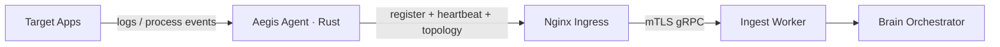

# 🦀 Host Agent Architecture: The Collection Sensor

The **Aegis AI Agent** is the platform's on-site collection sensor. Written in
**Rust** (Tokio async runtime), it is deployed inside a customer environment,
discovers the local topology, and streams telemetry outbound to the Aegis Core
over an mTLS-encrypted channel.

---

## 🏗️ Core Design Principles

The Agent is built for **minimal footprint**, **reliability**, and **safety**:

1. **Outbound-Only Tunneling**: The Agent never listens for inbound platform
   traffic. It establishes a hardened outbound connection to the Ingest layer
   through the Nginx ingress, so no port needs to be opened towards the customer.
2. **Static, Zero-Privilege Binary**: Compiled to a single dependency-free binary
   (< 20MB RSS), running as a non-root user with no capabilities.
3. **Redaction at the Source**: Sensitive values are redacted (`redaction/`)
   before any payload leaves the host.

---

## 🔐 Security Model

- **Mutual TLS**: The Agent requires a valid client certificate to talk to the
  Ingest layer — there is no unauthenticated path.
- **Two credentials, two lifetimes**:

  | Credential        | Used for                     | Storage                                   |
  | ----------------- | --------------------------- | ---------------------------------------- |
  | Deployment token  | First registration only      | `DEPLOYMENT_TOKEN` env, one-time          |
  | Agent secret      | All subsequent streaming      | Persisted locally (`.agent_secret` file)  |

  The deployment token format is `ag_<43+ URL-safe chars>`; only its hash is
  stored server-side and it is shown once in the Dashboard.
- **Constrained health endpoint**: an HTTP health server binds to
  `127.0.0.1:8081` by default (`HEALTH_BIND_ADDR` / `HEALTH_PORT` to override).
  Do not expose it publicly.

---

## 🌊 Runtime Flow

1. **Register** once with the company deployment token; receive and persist an
   `agent_id` + `agent_secret`.
2. **Discover** host, process, container and Kubernetes topology
   (`discovery.rs`, `extractor/`) where permissions allow.
3. **Stream** heartbeats and redacted topology/telemetry payloads outbound over
   mTLS.
4. **Expose** a local health endpoint for liveness/readiness only.

---

## 🧩 Module Map

| Module          | Responsibility                                        |
| --------------- | -------------------------------------------------- |
| `client.rs`     | Outbound mTLS transport to the Ingest layer          |
| `discovery.rs`  | Host / container / Kubernetes inventory              |
| `extractor/`    | Turns raw system state into structured records       |
| `redaction/`    | Strips secrets and PII before send                   |
| `database.rs`   | Local persistence of `agent_id` / `agent_secret`     |
| `health.rs`     | Local liveness / readiness HTTP endpoint             |
| `server.rs`     | Local admin surface (health, manual topology scan)   |
| `config.rs`     | Environment-driven configuration                     |

---

## ⚙️ Configuration

| Variable                     | Required          | Description                                      |
| ---------------------------- | ----------------- | --------------------------------------------- |
| `GATEWAY_URL`                | No                | Aegis Core endpoint. Defaults to `https://api.aegis-ai.fr`. |
| `DEPLOYMENT_TOKEN`           | Yes for first run | One-time registration token.                   |
| `AGENT_NAME`                 | No                | Friendly name shown in the Dashboard.          |
| `AGENT_ALLOW_HTTP`           | Local only        | `true` enables plain HTTP for local dev.        |
| `AGENT_SECRET_FILE_OVERRIDE` | No                | Custom path for the persisted credentials.      |
| `HEALTH_BIND_ADDR`           | No                | Health endpoint bind address (default `127.0.0.1`). |
| `HEALTH_PORT`                | No                | Health endpoint port (default `8081`).          |

---

*Aegis AI Host Sensor Engineering — 2026*
