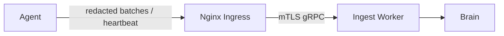

# 📡 Agent Telemetry

The Agent collects local topology and runtime signals, redacts them, and streams
them outbound to the Aegis Ingest layer over mTLS.

---

## Collected signals

| Signal               | Source                         | Purpose                             |
| -------------------- | ------------------------------ | --------------------------------- |
| Host metadata        | OS / process inspection        | Identify the node running the agent |
| Process events       | Runtime observation            | Activity and service mapping        |
| Container inventory  | Docker runtime, when present   | Map running workloads               |
| Kubernetes inventory | Kubernetes API, when configured| Map pods, services, namespaces      |
| Heartbeat            | Agent runtime loop             | Keep the Dashboard status current   |
| Health state         | Local health server            | Liveness / readiness only           |

---

## Delivery model

1. Register once; persist `agent_id` + `agent_secret`.
2. Open an outbound mTLS channel to the Ingest layer via the Nginx ingress.
3. Send periodic heartbeats and redacted topology/telemetry batches.
4. The Ingest Worker normalizes batches and forwards them to the Brain.

---

## Privacy & safety

- The `redaction/` module strips secrets and PII **before** any payload leaves
  the host.
- The deployment token is never included in telemetry; only the `agent_secret`
  is used, and only for transport authentication.
- The local health endpoint binds to `127.0.0.1` by default and exposes no
  telemetry content.
- Transport is outbound-only and mutually authenticated; a missing or invalid
  client certificate means no data is sent.

---

*Aegis AI Host Sensor Engineering — 2026*
