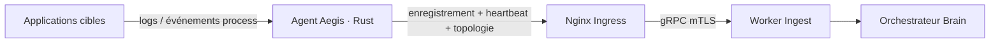

# 🦀 Architecture de l'Agent Hôte : le capteur de collecte

L'**Agent Aegis AI** est le capteur de collecte sur site de la plateforme. Écrit
en **Rust** (runtime asynchrone Tokio), il est déployé dans l'environnement d'un
client, découvre la topologie locale et diffuse sa télémétrie en sortie vers le
Cœur Aegis sur un canal chiffré mTLS.

---

## 🏗️ Principes de conception

L'Agent est conçu pour une **empreinte minimale**, la **fiabilité** et la
**sûreté** :

1. **Tunnel sortant uniquement** : l'Agent n'écoute jamais de trafic entrant de
   la plateforme. Il établit une connexion sortante durcie vers la couche Ingest
   via l'ingress Nginx ; aucun port n'a besoin d'être ouvert vers le client.
2. **Binaire statique, zéro privilège** : compilé en un binaire unique sans
   dépendance (< 20 Mo RSS), exécuté en utilisateur non-root sans capabilities.
3. **Redaction à la source** : les valeurs sensibles sont expurgées
   (`redaction/`) avant qu'un payload ne quitte l'hôte.

---

## 🔐 Modèle de sécurité

- **TLS mutuel** : l'Agent exige un certificat client valide pour parler à la
  couche Ingest — aucun chemin non authentifié.
- **Deux identifiants, deux durées de vie** :

  | Identifiant          | Sert à                        | Stockage                                  |
  | -------------------- | --------------------------- | --------------------------------------- |
  | Token de déploiement | Premier enregistrement seul   | Variable `DEPLOYMENT_TOKEN`, à usage unique |
  | Secret agent         | Tout le streaming ultérieur   | Persisté localement (fichier `.agent_secret`) |

  Le format du token de déploiement est `ag_<43+ caractères URL-safe>` ; seul son
  hash est stocké côté serveur et il est affiché une seule fois dans le Dashboard.
- **Endpoint de santé contraint** : un serveur HTTP de santé écoute sur
  `127.0.0.1:8081` par défaut (`HEALTH_BIND_ADDR` / `HEALTH_PORT` pour changer).
  Ne pas l'exposer publiquement.

---

## 🌊 Flux d'exécution

1. **Enregistrement** unique avec le token de déploiement de l'entreprise ;
   réception et persistance d'un `agent_id` + `agent_secret`.
2. **Découverte** de la topologie hôte, processus, conteneurs et Kubernetes
   (`discovery.rs`, `extractor/`) selon les permissions.
3. **Streaming** des heartbeats et des payloads de topologie/télémétrie expurgés,
   en sortie sur mTLS.
4. **Exposition** d'un endpoint de santé local pour la liveness/readiness
   uniquement.

---

## 🧩 Carte des modules

| Module          | Responsabilité                                       |
| --------------- | ------------------------------------------------- |
| `client.rs`     | Transport mTLS sortant vers la couche Ingest        |
| `discovery.rs`  | Inventaire hôte / conteneurs / Kubernetes           |
| `extractor/`    | Transforme l'état système brut en enregistrements   |
| `redaction/`    | Retire secrets et données personnelles avant envoi  |
| `database.rs`   | Persistance locale de `agent_id` / `agent_secret`   |
| `health.rs`     | Endpoint HTTP local de liveness / readiness         |
| `server.rs`     | Surface d'admin locale (santé, scan de topologie manuel) |
| `config.rs`     | Configuration pilotée par l'environnement           |

---

## ⚙️ Configuration

| Variable                     | Requis            | Description                                      |
| ---------------------------- | ----------------- | --------------------------------------------- |
| `GATEWAY_URL`                | Non               | Endpoint du Cœur Aegis. Défaut `https://api.aegis-ai.fr`. |
| `DEPLOYMENT_TOKEN`           | Oui au 1er lancement | Token d'enregistrement à usage unique.       |
| `AGENT_NAME`                 | Non               | Nom lisible affiché dans le Dashboard.          |
| `AGENT_ALLOW_HTTP`           | Local uniquement  | `true` active le HTTP simple pour le dev local. |
| `AGENT_SECRET_FILE_OVERRIDE` | Non               | Chemin personnalisé pour les identifiants persistés. |
| `HEALTH_BIND_ADDR`           | Non               | Adresse d'écoute de l'endpoint de santé (défaut `127.0.0.1`). |
| `HEALTH_PORT`                | Non               | Port de l'endpoint de santé (défaut `8081`).    |

---

*Ingénierie du capteur hôte Aegis AI — 2026*
