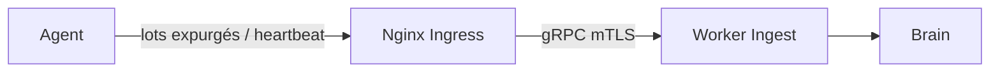

# 📡 Télémétrie de l'Agent

L'Agent collecte des signaux de topologie et d'exécution locaux, les expurge et
les diffuse en sortie vers la couche Ingest d'Aegis sur mTLS.

---

## Signaux collectés

| Signal                | Source                          | Objectif                            |
| --------------------- | ------------------------------- | --------------------------------- |
| Métadonnées hôte      | Inspection OS / processus        | Identifier le nœud exécutant l'agent |
| Événements process    | Observation runtime              | Cartographier l'activité et les services |
| Inventaire conteneurs | Runtime Docker, si présent       | Cartographier les charges en cours   |
| Inventaire Kubernetes | API Kubernetes, si configurée    | Cartographier pods, services, namespaces |
| Heartbeat             | Boucle runtime de l'agent        | Maintenir le statut à jour dans le Dashboard |
| État de santé         | Serveur de santé local           | Liveness / readiness uniquement      |

---

## Modèle de livraison

1. Enregistrement unique ; persistance de `agent_id` + `agent_secret`.
2. Ouverture d'un canal mTLS sortant vers la couche Ingest via l'ingress Nginx.
3. Envoi de heartbeats périodiques et de lots de topologie/télémétrie expurgés.
4. Le Worker Ingest normalise les lots et les transmet au Brain.

---

## Confidentialité & sûreté

- Le module `redaction/` retire secrets et données personnelles **avant** qu'un
  payload ne quitte l'hôte.
- Le token de déploiement n'est jamais inclus dans la télémétrie ; seul le
  `agent_secret` est utilisé, et uniquement pour l'authentification du transport.
- L'endpoint de santé local écoute sur `127.0.0.1` par défaut et n'expose aucun
  contenu de télémétrie.
- Le transport est sortant uniquement et mutuellement authentifié ; sans
  certificat client valide, aucune donnée n'est envoyée.

---

*Ingénierie du capteur hôte Aegis AI — 2026*
